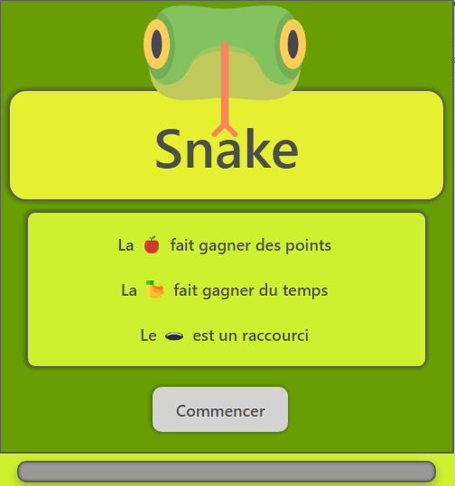

# Snake

Jeux du snake

### Pré-requis

- Npm

### Installation

Executez la commande ``npm i`` pour installer les dépendances

## Démarrage

Executez la commande ``npm run start`` pour démarrer le projet sur le port 4200

## Fabriqué avec

* [VSCode](https://code.visualstudio.com/) - Editeur de textes
* [NodeJs](https://nodejs.org/) - Framework Back
* [Angular](https://angular.io/) - Framework Front
* [Electron](https://www.electronjs.org/) - Framework Web applicaton

## Versions

**Dernière version stable :** 1.0.0

**Dernière version :** 1.0.0

Liste des versions : [Cliquer pour afficher](https://github.com/crouzicien/snake/tags)

## Auteurs
* **Sanfilippo Sylvain** _alias_ [@crouzicien](https://github.com/crouzicien)

## License
Ce projet est sous licence ``exemple: WTFTPL`` - voir le fichier [LICENSE.md](LICENSE.md) pour plus d'informations

